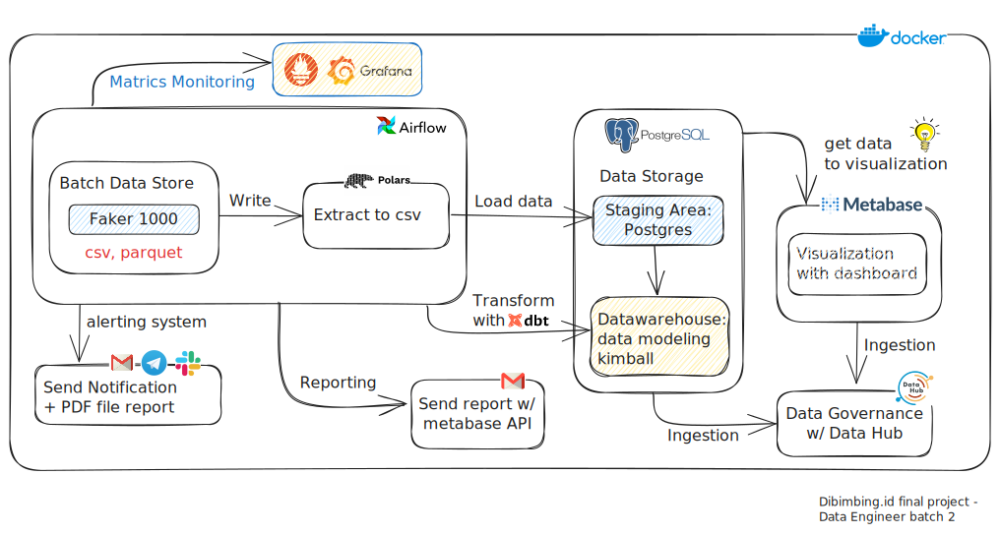

# Data Engineer | ETL Developer

#### Technical Skills: Problem Solving and Analysis, Python, SQL, Airflow

## Education Formal
- S1 Teknik Informatika at Stikom Poltek Cirebon (_2016_)
- SMK Teknik Komputer Jaringan at Mamba'ul ulum Cirebon (_2012_)

## Education Non - Formal
- Bootcamp Data Engineer Batch 2 at Dibimbing.id (_October 2023_)

## Work Experience
**IT SERVICES ADMINISTRATOR at PT. Mandala Finance Tbk (_Aug 2022 - Jul 2023_)**
- Support customer issues of all branches with SQL
- Coordinate with L2 other team to find solutions to problems
- Record and log ticket for each request / incident

**IT SERVICE INCIDENT (IT PRODUCTION) at PT. BFI Finance Tbk (_Jul 2020 - Jun 2022_)**
- Resolve OTRS ticket issues from all branches or head office
- Help check related to system problems using Profiler MSSQL
- Responsible for system CONFINS or update data in DB Production

**IT HELPDESK OFFICER at PT Bank Central Asia Tbk (_Jun 2017 - May 2020_)**
- Handle and diagnose technical issues via ticketing, email, phone
- Checks status updates for all BCA bank branches with PuTTY
- Supporting join domain PC request for all branch

## My Projects
### (Project 1) DataCraft ELT Kimball Modeling with Visual Metabase
link [Project 1](https://github.com/MuhammadMuhidin/DataCraft-ELT-Kimball-Modeling-with-Visual-Metabase)

Development data pipeline for the project with ELT concept and use metabase for visualization.
Raw data from faker will be extracted by polars into csv format, then PostgresOperator with .sql write to postgres. after that airflow send dbt run command to transformation data. airflow will use the metabase api to send reports via email. a metabase get data from postgres to visualization. and Data Hub organizes and stores metadata about your datasets.

### (Project 2) Implement RSA with HTML and Javascript
link [Project 2](https://github.com/MuhammadMuhidin/rsa)

This project aims to implement the RSA (Rivest-Shamir-Adleman) cryptographic algorithm using HTML and JavaScript. RSA is a public-key cryptography algorithm used for encrypting and decrypting data. Leveraging the power of basic mathematics, this project provides an interactive and easy-to-understand implementation.
## Key Features
1. **Interactive Encryption and Decryption**: Users can directly test the algorithm by entering text and instantly see the results of encryption and decryption.
2. **Key Management**: The system provides functions to generate the necessary public and private key pairs for encrypting and decrypting data.
3. **Visualization of RSA Process**: Using HTML elements and JavaScript graphics, the project visualizes the key steps in the RSA algorithm, making it easier to comprehend.

This project aims to provide practical understanding of the RSA algorithm while presenting an implementation accessible to anyone. With a simple interface and clear visualization, it is hoped that this project can serve as a valuable learning resource.

--------------------------------------------------
## Contact
Email: [muhammad.muhidin@outlook.com](mailto:muhammad.muhidin@outlook.com)  
for more information about my projects, please visit my [github](https://github.com/MuhammadMuhidin)
or download my latest resume [here](/assets/resume.pdf)
